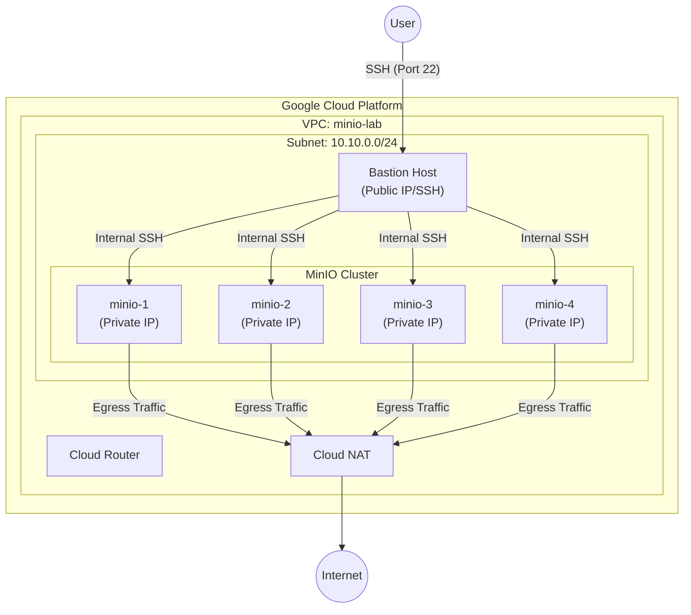

# MinIO Distributed Cluster on GCP (Reproducible)

This project provides a fully automated way to deploy a MinIO distributed cluster on GCP using `gcloud` and `Makefile`.

## Architecture Diagram



## Prerequisites

- `gcloud` CLI installed and authenticated.
- `make` installed.

## Getting Started

1.  **Configure:** Edit `config.mk` if you need to change the project ID, region, or node names.
2.  **Deploy:** Run the following command to create the entire infrastructure:
    ```bash
    make up
    ```
3.  **Access:**
    - **Direct SSH (via IAP):** `gcloud compute ssh minio-1 --zone=asia-southeast2-b --tunnel-through-iap`
    - **Access MinIO WebUI:** Run `make tunnel` to create an SSH tunnel to `minio-1`, then open [http://localhost:9001](http://localhost:9001) in your browser.
4.  **Teardown:** To destroy all resources, run:
    ```bash
    make down
    ```

## Architecture Details

- **Network:** Custom VPC with a single private subnet. SSH access is restricted to the bastion host via firewall rules.
- **Bastion Host:** Publicly accessible VM used as a jump box.
- **MinIO Nodes:** 4 private VMs.
    - `minio-1`, `minio-2`: 100GB pd-standard disks.
    - `minio-3`, `minio-4`: 30GB pd-ssd disks.
- **Cloud NAT:** Allows private MinIO nodes to access the internet for updates and installation without being exposed to inbound traffic.
